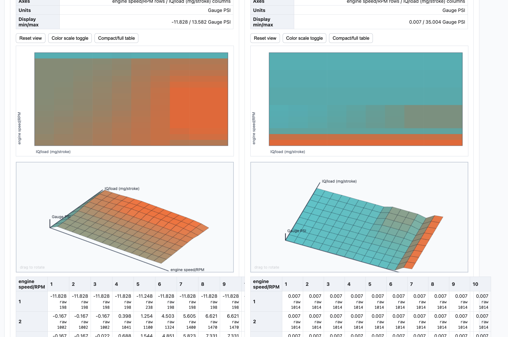
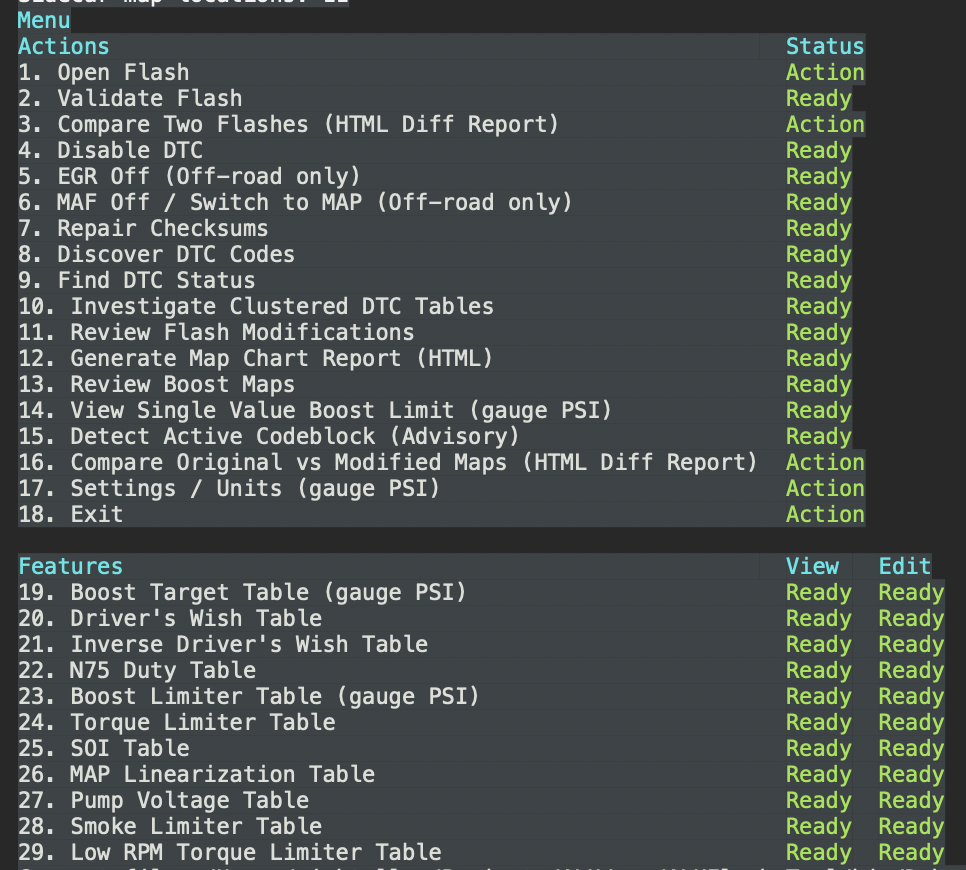

# ALH Flash Editor Tool

.NET 7 console tool for inspecting raw ALH EDC15V/EDC15VM flash binaries,
discovering possible DTC codes, finding DTC candidates, applying
profile-controlled DTC edits, repairing checksums, and writing JSON/HTML
reports.


# 1.9 TDI ALH Flash Editor Tool Tutorial

This video provides a complete walkthrough of the open-source flash editor tool used for modifying EDC15 VM engine control units. 

## Watch the Video
Click the image below to watch the step-by-step tutorial on YouTube:

## Watch the Video



[](https://www.youtube.com/watch?v=DHF3Maqpc1o)


## Video Highlights & Core Features Covered
* **Initial Setup**: How to organize and load your raw `.bin` or `.oi` files into the `original` folder directory.
* **Automated Shortcuts**: Disabling EGR systems, turning off MAF sensors, and repairing file checksums automatically.
* **Map Visualizations**: Generating comprehensive HTML heat maps and structural raw data tables to verify your ECU modifications.
* **Table Editing**: Modifying the boost limiter tables by targeting specific individual values, full rows, or complete columns.

## Downloads

- Modern M Series Macs [macOS arm64 zip](build/dist/ALHFlashTool-0.0.2-macos-arm64.zip)
- Older Legacy Macs [macOS x64 zip](build/dist/ALHFlashTool-0.0.2-macos-x64.zip)
- Most Common Linux [Linux x64 tar.gz](build/dist/ALHFlashTool-0.0.2-linux-x64.tar.gz)
- ARM Linux [Linux arm64 tar.gz](build/dist/ALHFlashTool-0.0.2-linux-arm64.tar.gz)
- Most Common Windows [Windows x64 zip](build/dist/ALHFlashTool-0.0.2-windows-x64.zip)
- ARM Windows [Windows arm64 zip](build/dist/ALHFlashTool-0.0.2-windows-arm64.zip)

The tool never edits the original file in place. DTC editing is blocked when
flash validation fails, and patched binaries are written only after checksum
repair validates cleanly.

## Managed Folders

The app creates two folders in the working directory on startup:

- `original/` for original flash images
- `modified/` for patched images, checksum-repaired images, and reports

Place raw `.bin` or `.ori` flash files in `original/`. The `Open Flash` menu lists
original files as `o1`, `o2`, etc. and files already in `modified/` as `m1`, `m2`,
etc. Type the token shown beside the file to load it. Manual path entry is not
used in the normal workflow.

## Commands

```bash
dotnet build ALHFlashTool.sln
dotnet test ALHFlashTool.sln
dotnet run --project src/ALHFlash.Tool/ALHFlash.Tool.csproj
```

### Release Builds

To generate distribution bundles for macOS, Linux, and Windows across the
common x64 and ARM64 targets:

```bash
./build/build-release.sh
```

The script writes release archives and a manifest to `build/dist/`.
It uses the latest SemVer tag such as `v1.0.0` as the release version.

## Validation

Opening a flash file runs validation immediately. The validator checks:

- supported raw binary size: 256KB, 512KB, or 1024KB
- binary shape, avoiding blank/filler/text-like files
- EDC identity marker such as ASCII `EDC  `
- extracted VW/Bosch/software identity fields when present
- supported EDC15V/EDC15VM checksum layout
- current checksum status
- DTC patch profile compatibility

`PASS` allows editing. `WARN` requires explicit confirmation. `FAIL` blocks
editing.

## DTC Matching

The editable profile lives at `profiles/alh-edc15v.dtcprofile.json` and controls
search preferences such as byte order and aliases. The v1 DTC edit logic is
built in for EDC15V-style timer entries, so no patch rules are required.

A found DTC is fully enabled when the surrounding 16-bit decimal entry is:

```text
00048 00048 [address] [DTC]
```

The tool proposes this change:

```text
65535 00000 [address] [DTC]
```

If the entry reads `65535 00048 [address] [DTC]`, the tool reports it as
partially disabled and can complete the disable by changing only the healing
timer to `00000`:

```text
65535 00000 [address] [DTC]
```

If the entry already reads `65535 00000 [address] [DTC]`, the tool reports it
as already disabled and does not write a change. Any other timer combination is
reported as unexpected and is not patchable.

## DTC Discovery

`Discover DTC Codes` is a read-only scan of the opened flash. It walks strict
EDC15V 4-word timer entries and reports unique possible `Pxxxx` codes for:

- `00048 00048 [address] [DTC]`
- `65535 00048 [address] [DTC]`
- `65535 00000 [address] [DTC]`

Other timer combinations, including `00048 65535`, are ignored as noise. The
scanner reverse-decodes VAG decimal-style DTC words such as `0x4672 -> P1626`
and ignores packed companion words such as `0x1626`.

Descriptions are loaded from two editable local catalogs:

- `profiles/alh-edc15v.dtc-descriptions.json` for VW/ALH-specific descriptions
- `profiles/generic-obdii.dtc-descriptions.json` for generic OBD-II fallback descriptions

If both catalogs contain the same code, the VW/ALH-specific entry wins. Codes
missing from both catalogs are shown as `Unknown`.

## Modification Review

`Review Flash Modifications` is a read-only scan of the opened flash. It uses
the same profile-gated scanners as the editing features and reports known
markers for:

- EGR maps already maxed to the configured off value
- MAF/MAP switches already set to the MAP-based value
- optional configured MAF maps already cleared
- DTC/P-code timer entries that are already disabled or partially disabled

The review does not patch bytes or repair checksums. It writes JSON and HTML
reports to `modified/` so a modified flash can be audited before flashing.

## Boost Review And Target Editing

`Review Boost Maps` scans configured boost-related maps from
`profiles/alh-edc15v.boostprofile.json`. It reviews boost target, N75 duty,
SVBL, and other configured boost candidates without changing the flash. The
review also runs read-only discovery around detected SVBL anchors to find
likely Bosch map packages near common ALH boost target, N75, limiter, and
correction relationships. Discovered maps are diagnostic until they are added to
the profile and confirmed; they are not edited automatically.

The discovery pass also uses VP37 guide-style pressure relationships: stock
requested boost is expected near `SVBL - 40 mbar`, and boost limiter candidates
are expected above requested boost. This helps find factory maps even when fixed
public offsets do not transfer to a specific software version. Discovery checks
common `16x10`, `16x12`, `10x10`, and review-only shape variants, and reports
MAP sensor linearization candidates for review without editing them.

The bundled default boost profile includes the verified `038906012FF` sample
requested boost maps at `0x5654C`, `0x6654C`, and `0x7654C` as `16x10` mirrored
tables. They remain profile-gated so other software versions can use their own
confirmed offsets.

`Edit Boost Target (Gauge PSI)` edits only validated mirrored boost target maps.
The console asks for gauge PSI values and converts them to ECU-native absolute
mbar internally:

```text
absolute_mbar = (gauge_psi + atmospheric_psi) * 68.9476
```

The default atmospheric reference is `14.7 PSI`. V1 supports a percent increase
plus a maximum gauge-PSI cap. N75, PID, limiter, correction, and diagnostic
maps are review-only in this first version. Newly discovered maps are also
review-only until promoted into the editable boost profile.

## EGR Off

`EGR Off (Off-road only)` scans configured ALH EDC15V/EDC15VM EGR air-mass
request maps and, after per-map confirmation, maxes editable map words to the
profile target value. The default editable profile is
`profiles/alh-edc15v.egrprofile.json` and checks 13x16 little-endian maps at
`0x54E4E`, `0x64E4E`, and `0x74E4E` with raw target value `8500`.

This feature does not automatically disable EGR DTCs or assume a universal EGR
switch byte. If N18 is unplugged and diagnostic suppression is needed, use the
explicit DTC workflow separately.

## MAF Off / Switch To MAP

`MAF Off / Switch to MAP (Off-road only)` scans for configured MAF/MAP
smoke-limiter source switch contexts and, after per-location confirmation,
changes the switch word from a MAF-based value to the MAP-based value. The
default editable profile is `profiles/alh-edc15v.mafprofile.json`.

The default pattern is:

```text
B7 08 87 10 6C 07 20 4E A0 0F 70 17 1C 25 F4 01 00 00 00 00 24 13 EC 13 00 00 ?? ?? E8 03 18 FC
```

The switch word is little-endian at pattern offset `+26`. Values `0` and `1`
are treated as MAF-based and are changed to `257` (`01 01`). A value of `257`
is reported as already MAP-based. Other values are reported as unexpected and
are not patched.

The profile can also define optional `mafMaps` entries. After the switch is
patched or already MAP-based, the tool scans those configured maps and warns
that clearing them should not matter once the smoke-limiter source is switched
to MAP. Each ready map defaults to skipped unless the user explicitly types
`YES`; arbitrary or unvalidated ranges are never cleared.

This feature does not automatically disable MAF DTCs. If the sensor is
physically unplugged and codes such as `P0100`-`P0104` appear, use the explicit
DTC workflow separately.

## Reports

For DTC operations the tool writes:

- `modified/<name>.patched.bin`
- `modified/<name>.patch-report.json`
- `modified/<name>.patch-report.html`

For checksum-only operations the tool writes:

- `modified/<name>.checksum-repaired.bin`
- `modified/<name>.patch-report.json`
- `modified/<name>.patch-report.html`

For DTC discovery operations the tool writes:

- `modified/<name>.dtc-discovery-report.json`
- `modified/<name>.dtc-discovery-report.html`

For modification review operations the tool writes:

- `modified/<name>.modification-review-report.json`
- `modified/<name>.modification-review-report.html`

For boost review operations the tool writes:

- `modified/<name>.boost-review-report.json`
- `modified/<name>.boost-review-report.html`

For boost target edit operations the tool writes:

- `modified/<name>.boost-target.bin`
- `modified/<name>.boost-target-report.json`
- `modified/<name>.boost-target-report.html`

For EGR Off operations the tool writes:

- `modified/<name>.egr-off.bin`
- `modified/<name>.egr-off-report.json`
- `modified/<name>.egr-off-report.html`

For MAF Off / Switch to MAP operations the tool writes:

- `modified/<name>.maf-map.bin`
- `modified/<name>.maf-map-report.json`
- `modified/<name>.maf-map-report.html`

If an output or report already exists, a timestamp is added before the extension
so existing files are not overwritten.

The HTML report is self-contained and includes validation checks, identity
fields, all DTC, EGR, or MAF/MAP candidates, approved/skipped edits, byte-level
before/after changes, checksum block repairs, hashes, and final status.

## Notes

Use this only for lawful calibration, diagnostic, and repair workflows. Removing
diagnostics from emissions-related systems may be illegal for road use.

The EDC15V identity and checksum behavior was cross-checked against public
VAGEDCSuite source while keeping this implementation self-contained.
